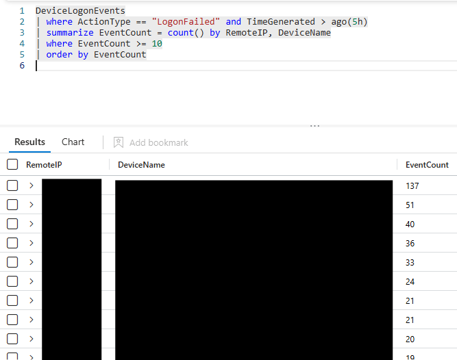
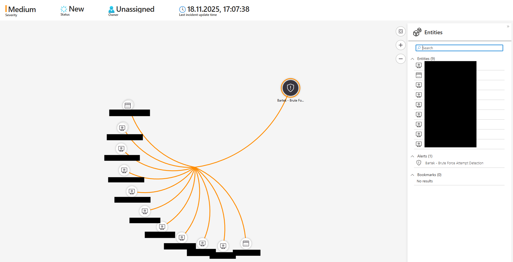
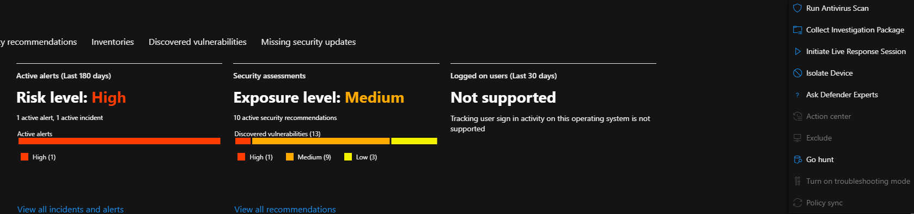
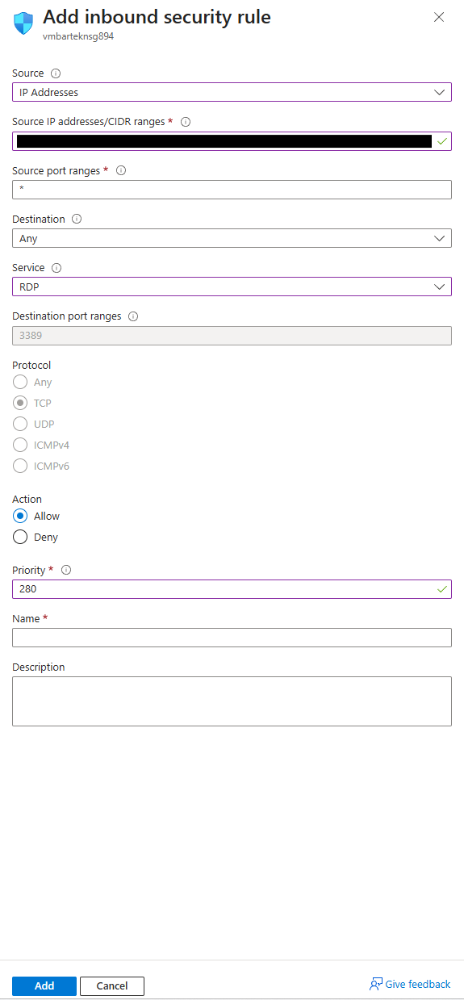
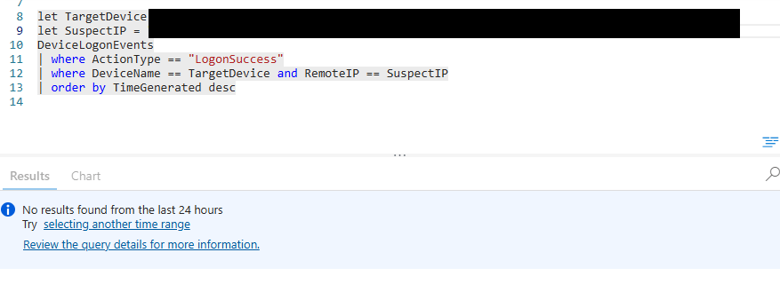
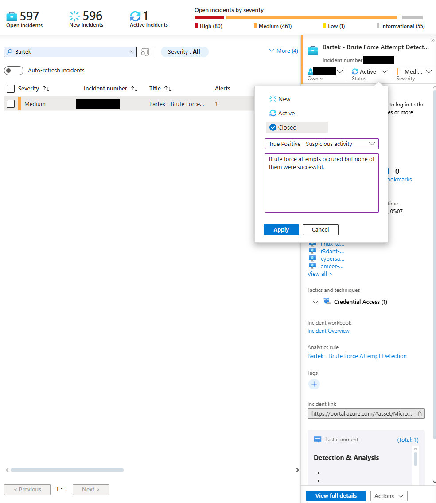

# Incident Response Mini-Case: Azure VM Brute Force Attempts (Microsoft Sentinel + Defender)

## Executive Summary

On **2025-11-18 at 17:07 UTC** the custom analytics rule **“Brute Force Attempt Detection”** in Microsoft Sentinel fired. Over the last 5 hours, **17 public IP addresses** attempted to log in to **21 Azure VMs**, generating roughly **550 failed logon attempts**. 

No logon successes from those IPs were found.
Affected VMs were isolated, antivirus scans were run, NSG rules were restricted, and follow-up detection and hardening actions were proposed.

The incident was closed as **True Positive - suspicious activity**, with **no confirmed compromise**.

---

## Scenario / Context

The SOC received a Sentinel incident based on the rule:

> Same remote IP address has failed to log in to the same local host (Azure VM) 10 times or more within the last 5 hours.

Goal of the investigation:

- confirm whether brute force attempts were real,
- check if any attempts succeeded,
- contain exposed assets,
- propose improvements to detections, NSG defaults and runbooks.

---

## Tools & Platforms

- **Microsoft Sentinel** - analytics rule, incidents, investigation graph, KQL
- **Microsoft Defender for Endpoint** - device isolation, AV scans, recommendations
- **Microsoft Azure** - NSG inbound rules for exposed VMs
- **Kusto Query Language (KQL)** - log analysis in `DeviceLogonEvents`

---

## Detection & Initial Triage

1. **Sentinel incident overview**

   - Rule: `Bartek - Brute Force Attempt Detection`
   - Severity: `Medium`
   - Evidence: 21 related events, 1 alert
   - Tactic / Technique: `Credential Access (T1110.001 - Password Guessing)`
  
     _Screenshot:_ incident list + incident details
     ``

2. **KQL - confirm brute-force pattern**

```kql
DeviceLogonEvents
| where ActionType == “LogonFailed” and TimeGenerated > ago(5h)
| summarize EventCount=count() by RemoteIP, DeviceName
| where EventCount >= 10
| order by EventCount
```

This query showed:
- **21 VMs** targeted,
- **17 unique RemoteIP values**,
- up to **137 failed logons** per IP/VM pair,
- **~550 failed logons** in total.

  _Screenshot:_ KQL results table
  

---

## Investigation Steps

### 1. Claim and activate the incident

- Assigned the incident to myself and changed status from `New` to `Active`.
- Opened the **Investigation graph** to visualise all affected VMs and relationships.

  _Screenshot:_ investigation graph with multiple VMs tied to one incident
  

### 2. Containment - devices & network

For each affected VM:
1. Opened the device page in **Microsoft Defender for Endpoint** to validate risk level recommendations.

  _Screenshots:_ device overview (risk level High, exposure Medium, discovered vulns)
  

2. Ran an **antivirus scan* from Defender portal (no malware found).
3. In **Azure NSG**, restricted inbound access:
   - replaced "open to Internet" rules with a rule allowing RDP/SSH only from a specific admin IP.
   - goal: stop random Internet brute-force attempts while keeping controlled admin access.
  
   _Screenshots:_ NSG inbound rule (RDP, single IP, TCP)
   

### 3. Check for successful logons

For each VM / attacking IP pair, ran:

```kql
let TargetDevice = “TargetDeviceName”;
let SuspectIP = “IpOfTheSuspect”
DeviceLogonEvents
| where ActionType == “LogonSuccess”
| where DeviceName == TargetDevice and RemoteIP == SuspectIP
| order by TimeGenerated desc
```

**Result**: no matching `LogonSuccess` events for any suspect IP / target VM combination.

_Screenshot:_ query returning no results


### 4. Close the incident

- Added a closing comment and set the incident to:
  - Status: `Closed`
  - Classification: `True Positive - Suspicious activity`
  - Comment: "Brute force attempts occurred but none of them were successful."
 
    _Screenshot:_ closing dialogue with comment
    

---

## Condensed Timeline (Lab Scenario)

- **13:32** - First brute force attempts against exposed Azure VMs begin.
- **17:07** - Sentinel analytics rule fires (threshold: >= 10 failed logons per IP/VM in the last 5 hours).
- **17:16** - Incident claimed and set to `Active`.
- **17:23-17:30** - Devices isolated logically (AV scans, NSG restrictions applied).
- **17:33** - Verified there was **no successful logons** from attacking IPs.
- **17:40** - Incident closed as True Positive - brute force attempts, no compromise.

> Note: Times are approximate and represent a realistic flow for a lab scenario, not production SLAs.

---

## Findings & Impact

**1. Over-exposed NSG defaults**
	- New VMs were created with broadly open inbound rules, making them easily discoverable and brute-forceable from the Internet.
**2. No detection for successful brute force**
	- Existing rules focused only on failed attempts.
	- A successful brute force would not have raised a higher-urgency alert immediately.
**3. Runbook sequence**
	- Current runbook pushed analysts toward isolation actions before confirming actual compromise.
	- This can waste time/compute and reduce focus on more critical alerts.
**4. No severity scaling with volume**
	- Same rule/severity for 10 and 500+ attempts over 5 hours.
	- Mussing opportunity to prioritise more aggressive brute-force campaigns.

---

## Response & Recommended Improvements

**Actions taken in this lab:**
- Isolated / restricted access to all affected VMs via NSG.
- Ran AV scans on all targeted hosts (no malware detected).
- Documented the incident, KQL queries and findings.

**Suggested improvements:**
**1. Harden NSG baselines**
	- Default templates for new VMs should allow inbound RDP/SSH **only for admin ranges / VPN**, never from `Any/Any`.
**2. Add "successful brute force" detection**
	- New Sentinel rule looking for:
		- multiple `LogonFailed` followed by `LogonSuccess` from the same RemoteIP within a short window.
**3. Adjust brute-force severities**
	- Keep existing rule at Medium for low-volume noise.
	- Add another rule with higher threshold (e.g. 100 failures in 1-2h) at `High` to prioritise aggressive campaigns.
**4. Refine runbook**
	- Separate **"failed brute force (noise, monitor)"** from **"confirmed or highly suspected compromise (isolate immediately)"**.

---

## MITRE ATT&CK Mapping

- **T1110.001 - Brute Force: Password Guessing**
  Repeated logon failures against multiple Azure VMs using common admin usernames.
- **T1580 - Cloud Infrastructure Discovery** (possible)
  Wide scanning of exposed Internet-facing VMs can also be interpreted as adversaries discovering cloud assets and surfaces.
